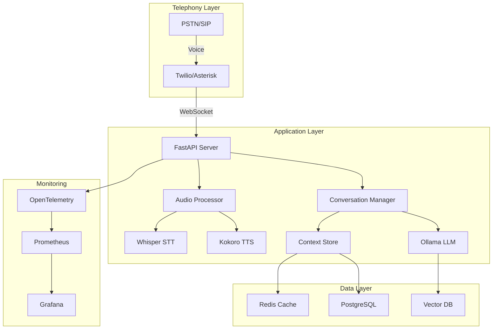

# Local Call Center AI

A production-ready, fully local implementation of an AI-powered call center solution. This project is inspired by and based on [Microsoft's Call Center AI](https://github.com/microsoft/call-center-ai), but redesigned to run entirely on-premise without dependency on cloud services.

## Table of Contents

- [Overview](#overview)
- [Architecture](#architecture)
- [Features](#features)
- [Technology Stack](#technology-stack)
- [Prerequisites](#prerequisites)
- [Installation](#installation)
- [Configuration](#configuration)
- [Production Deployment](#production-deployment)
- [Performance Optimization](#performance-optimization)
- [Monitoring & Observability](#monitoring--observability)
- [Security Considerations](#security-considerations)
- [API Documentation](#api-documentation)
- [Troubleshooting](#troubleshooting)
- [Contributing](#contributing)
- [License](#license)

## Overview

Local Call Center AI is an enterprise-grade, on-premise solution for automated customer service calls. Unlike the original Microsoft implementation which relies on Azure services, this implementation runs entirely on local infrastructure, providing:

- **Complete Data Privacy**: All processing happens on-premise
- **Cost Efficiency**: No cloud service fees after initial setup
- **Low Latency**: Sub-200ms response times for voice interactions
- **Customizability**: Full control over models and processing pipeline

### Key Differences from Microsoft's Implementation

| Feature | Microsoft Call Center AI | Local Call Center AI |
|---------|-------------------------|---------------------|
| Speech-to-Text | Azure AI Speech | OpenAI Whisper-tiny (local) |
| Text-to-Speech | Azure AI Speech | Kokoro TTS (local) |
| LLM | Azure OpenAI | Ollama (llama3.2:3b) |
| Telephony | Azure Communication Services | Twilio/Asterisk |
| Infrastructure | Azure Container Apps | Docker/Kubernetes |
| Data Storage | Azure Cosmos DB | Redis/PostgreSQL |
| Search | Azure AI Search | Local vector DB |

## Architecture



## Features

### Core Capabilities

- **Real-time Voice Processing**
  - Voice Activity Detection (VAD) with adaptive thresholds
  - Echo cancellation and noise suppression
  - Automatic gain control
  - Support for 8kHz μ-law (telephony) and 16kHz PCM

- **Natural Language Understanding**
  - Context-aware conversations with memory
  - Multi-turn dialogue management
  - Intent recognition and entity extraction
  - Support for multiple languages (configurable)

- **Intelligent Response Generation**
  - Streaming LLM responses for low latency
  - Conversation history tracking
  - Dynamic response adjustment based on context
  - Configurable personas and knowledge bases

- **Production Features**
  - Horizontal scaling support
  - Circuit breakers and retry mechanisms
  - Health checks and readiness probes
  - Comprehensive logging and tracing
  - A/B testing capabilities

## Technology Stack

### Core Components

- **Language**: Python 3.12+
- **Web Framework**: FastAPI with WebSocket support
- **Speech Recognition**: OpenAI Whisper (tiny model for low latency)
- **Speech Synthesis**: Kokoro TTS
- **Language Model**: Ollama with llama3.2:3b
- **Telephony**: Twilio API / Asterisk PBX
- **Message Queue**: Redis Streams
- **Database**: PostgreSQL 15+ with pgvector
- **Cache**: Redis 7+
- **Container Runtime**: Docker 24+
- **Orchestration**: Kubernetes 1.28+ (optional)

### Monitoring Stack

- **Metrics**: Prometheus + Grafana
- **Tracing**: OpenTelemetry + Jaeger
- **Logging**: Fluentd + Elasticsearch
- **Alerting**: AlertManager

## Prerequisites

### Hardware Requirements

**Minimum (Development)**:
- CPU: 8 cores (x86_64 or ARM64)
- RAM: 16GB
- Storage: 50GB SSD
- GPU: Optional (improves Whisper performance)

**Recommended (Production)**:
- CPU: 16+ cores with AVX2 support
- RAM: 32GB+
- Storage: 200GB+ NVMe SSD
- GPU: NVIDIA T4 or better (for Whisper acceleration)
- Network: 1Gbps+ with low latency

### Software Requirements

- Ubuntu 22.04 LTS or RHEL 8+
- Docker 24.0+
- Docker Compose 2.20+
- Python 3.12+
- Node.js 18+ (for development tools)
- CUDA 12.0+ (if using GPU acceleration)

## Installation

### Quick Start (Development)

```bash
# Clone the repository
git clone https://github.com/yourusername/call-center-ai-local.git
cd call-center-ai-local

# Run the setup script
chmod +x scripts/setup-local.sh
./scripts/setup-local.sh

# Configure environment
cp .env.example .env
# Edit .env with your configuration

# Start all services
./scripts/start-services.sh

# In a new terminal, start the API server
source .venv/bin/activate
uvicorn server:app --host 0.0.0.0 --port 8000 --reload
```

### Production Installation

```bash
# Install dependencies
sudo apt update && sudo apt install -y \
    docker.io docker-compose \
    python3.12 python3.12-venv \
    redis-server postgresql-15 \
    build-essential pkg-config \
    libssl-dev libffi-dev

# Clone and setup
git clone https://github.com/yourusername/call-center-ai-local.git
cd call-center-ai-local

# Create virtual environment
python3.12 -m venv .venv
source .venv/bin/activate

# Install Python dependencies
pip install --upgrade pip setuptools wheel
pip install -r requirements.txt

# Download models
python scripts/download_models.py

# Initialize database
python scripts/init_db.py

# Build Docker images
docker-compose build

# Start services
docker-compose up -d
```

## Configuration

### Environment Variables

Create a `.env` file with the following configuration:

```bash
# Server Configuration
SERVER_HOST=0.0.0.0
SERVER_PORT=8000
PUBLIC_URL=https://your-domain.com
ENVIRONMENT=production

# Telephony Configuration
TELEPHONY_PROVIDER=twilio  # or 'asterisk'
TWILIO_ACCOUNT_SID=your_account_sid
TWILIO_AUTH_TOKEN=your_auth_token
TWILIO_PHONE_NUMBER=+1234567890

# Model Configuration
WHISPER_MODEL=openai/whisper-tiny
WHISPER_DEVICE=cuda  # or 'cpu'
WHISPER_COMPUTE_TYPE=float16  # or 'float32'
OLLAMA_HOST=http://localhost:11434
OLLAMA_MODEL=llama3.2:3b
TTS_MODEL=kokoro
TTS_VOICE=af_heart
TTS_LANGUAGE=en

# Performance Tuning
MAX_CONCURRENT_CALLS=100
AUDIO_BUFFER_SIZE_MS=500
VAD_SENSITIVITY=3
RESPONSE_TIMEOUT_MS=5000
MAX_CONVERSATION_TURNS=50

# Database Configuration
POSTGRES_HOST=localhost
POSTGRES_PORT=5432
POSTGRES_DB=callcenter
POSTGRES_USER=callcenter_user
POSTGRES_PASSWORD=secure_password

# Redis Configuration
REDIS_HOST=localhost
REDIS_PORT=6379
REDIS_PASSWORD=redis_password

# Monitoring
ENABLE_METRICS=true
ENABLE_TRACING=true
OTEL_EXPORTER_OTLP_ENDPOINT=http://localhost:4317
LOG_LEVEL=INFO
```

### Advanced Configuration

See `config.yaml` for detailed configuration options including:

- Audio processing parameters
- Model inference settings
- Caching strategies
- Rate limiting
- Security policies

## Production Deployment

### Docker Compose Deployment

```yaml
version: '3.8'

services:
  app:
    build: .
    environment:
      - ENVIRONMENT=production
    ports:
      - "8000:8000"
    volumes:
      - ./models:/app/models
      - ./logs:/app/logs
    deploy:
      replicas: 3
      resources:
        limits:
          cpus: '4'
          memory: 8G
        reservations:
          cpus: '2'
          memory: 4G
    healthcheck:
      test: ["CMD", "curl", "-f", "http://localhost:8000/health"]
      interval: 30s
      timeout: 10s
      retries: 3

  ollama:
    image: ollama/ollama:latest
    volumes:
      - ollama_data:/root/.ollama
    deploy:
      resources:
        reservations:
          devices:
            - driver: nvidia
              count: 1
              capabilities: [gpu]

  redis:
    image: redis:7-alpine
    command: redis-server --appendonly yes --requirepass ${REDIS_PASSWORD}
    volumes:
      - redis_data:/data

  postgres:
    image: postgres:15
    environment:
      - POSTGRES_DB=${POSTGRES_DB}
      - POSTGRES_USER=${POSTGRES_USER}
      - POSTGRES_PASSWORD=${POSTGRES_PASSWORD}
    volumes:
      - postgres_data:/var/lib/postgresql/data

volumes:
  ollama_data:
  redis_data:
  postgres_data:
```

### Kubernetes Deployment

See the `k8s/` directory for production-ready Kubernetes manifests including:

- Deployment with autoscaling
- Service mesh integration
- ConfigMaps and Secrets
- Persistent Volume Claims
- Network Policies
- Pod Disruption Budgets

### High Availability Setup

1. **Load Balancing**: Use HAProxy or NGINX for distributing calls
2. **Database Replication**: Configure PostgreSQL streaming replication
3. **Redis Sentinel**: Setup Redis Sentinel for automatic failover
4. **Model Caching**: Implement distributed model caching
5. **Geographic Distribution**: Deploy across multiple regions

## Performance Optimization

### Model Optimization

```python
# Whisper Optimization
- Use whisper-tiny for <100ms latency
- Enable CUDA if available
- Implement voice activity detection
- Use streaming transcription

# LLM Optimization
- Use quantized models (4-bit/8-bit)
- Implement response streaming
- Cache common responses
- Use smaller context windows

# TTS Optimization
- Pre-generate common phrases
- Use neural vocoder caching
- Implement audio streaming
- Optimize sample rates
```

### System Tuning

```bash
# Increase file descriptors
echo "* soft nofile 65536" >> /etc/security/limits.conf
echo "* hard nofile 65536" >> /etc/security/limits.conf

# Optimize network settings
cat >> /etc/sysctl.conf << EOF
net.core.somaxconn = 65536
net.ipv4.tcp_max_syn_backlog = 65536
net.ipv4.ip_local_port_range = 1024 65535
net.ipv4.tcp_tw_reuse = 1
EOF

# Apply settings
sysctl -p
```

## Monitoring & Observability

### Key Metrics

| Metric | Target | Alert Threshold |
|--------|--------|-----------------|
| Response Latency | <200ms | >500ms |
| Transcription Accuracy | >95% | <90% |
| Call Success Rate | >99% | <95% |
| CPU Usage | <70% | >85% |
| Memory Usage | <80% | >90% |
| Concurrent Calls | - | >80% capacity |

### Dashboards

Access monitoring dashboards:
- Grafana: http://localhost:3000
- Prometheus: http://localhost:9090
- Jaeger: http://localhost:16686

### Logging

```python
# Structured logging example
import structlog

logger = structlog.get_logger()

logger.info(
    "call_processed",
    call_id=call_id,
    duration_ms=duration,
    transcription_confidence=confidence,
    response_tokens=tokens
)
```

## Security Considerations

### Authentication & Authorization

- JWT-based API authentication
- Role-based access control (RBAC)
- API key management
- OAuth2 integration support

### Data Protection

- End-to-end encryption for audio streams
- At-rest encryption for databases
- PII detection and masking
- GDPR compliance features

### Network Security

- TLS 1.3 for all communications
- Certificate pinning
- Rate limiting and DDoS protection
- Web Application Firewall (WAF) rules

### Compliance

- Call recording with consent
- Audit logging
- Data retention policies
- Regular security audits

## API Documentation

### REST API Endpoints

```bash
# Health Check
GET /health

# Initiate Call
POST /api/v1/calls
{
  "to_number": "+1234567890",
  "from_number": "+0987654321",
  "context": {
    "customer_id": "123",
    "reason": "support"
  }
}

# Get Call Status
GET /api/v1/calls/{call_id}

# End Call
DELETE /api/v1/calls/{call_id}

# Get Transcript
GET /api/v1/calls/{call_id}/transcript

# WebSocket Endpoint
WS /ws/audio/{call_id}
```

### WebSocket Protocol

```javascript
// Connect to WebSocket
const ws = new WebSocket('wss://your-domain.com/ws/audio/call123');

// Send audio data
ws.send({
  event: 'media',
  media: {
    payload: 'base64_encoded_audio',
    timestamp: Date.now()
  }
});

// Receive transcription
ws.onmessage = (event) => {
  const data = JSON.parse(event.data);
  if (data.event === 'transcript') {
    console.log('User said:', data.text);
  }
};
```

## Troubleshooting

### Common Issues

1. **High Latency**
   - Check model loading times
   - Verify GPU acceleration is enabled
   - Review network latency
   - Check for CPU throttling

2. **Poor Transcription Quality**
   - Verify audio quality (8kHz minimum)
   - Check for background noise
   - Adjust VAD sensitivity
   - Update Whisper model

3. **Memory Leaks**
   - Monitor process memory usage
   - Check for unclosed connections
   - Review model loading/unloading
   - Enable memory profiling

4. **Connection Drops**
   - Check firewall rules
   - Verify WebSocket timeouts
   - Review proxy configurations
   - Check for network issues

### Debug Mode

```bash
# Enable debug logging
export LOG_LEVEL=DEBUG
export ENABLE_PROFILING=true

# Run with debugging
python -m debugpy --listen 5678 --wait-for-client server.py
```

## Contributing

We welcome contributions! Please see our [Contributing Guidelines](CONTRIBUTING.md) for details.

### Development Setup

```bash
# Install development dependencies
pip install -r requirements-dev.txt

# Run tests
pytest tests/ -v --cov=app

# Run linting
black app/
flake8 app/
mypy app/

# Run security checks
bandit -r app/
safety check
```

### Code Standards

- Follow PEP 8 style guide
- Maintain >90% test coverage
- Document all public APIs
- Add type hints to all functions
- Update CHANGELOG.md

## License

This project is licensed under the Apache License 2.0 - see the [LICENSE](LICENSE) file for details.

## Acknowledgments

This project is based on and inspired by [Microsoft's Call Center AI](https://github.com/microsoft/call-center-ai). We've adapted it for on-premise deployment while maintaining the core concepts and architecture.

Special thanks to:
- The Microsoft team for the original implementation
- OpenAI for Whisper models
- Ollama team for local LLM support
- The open-source community

---

For commercial support and enterprise features, please contact: support@your-domain.com